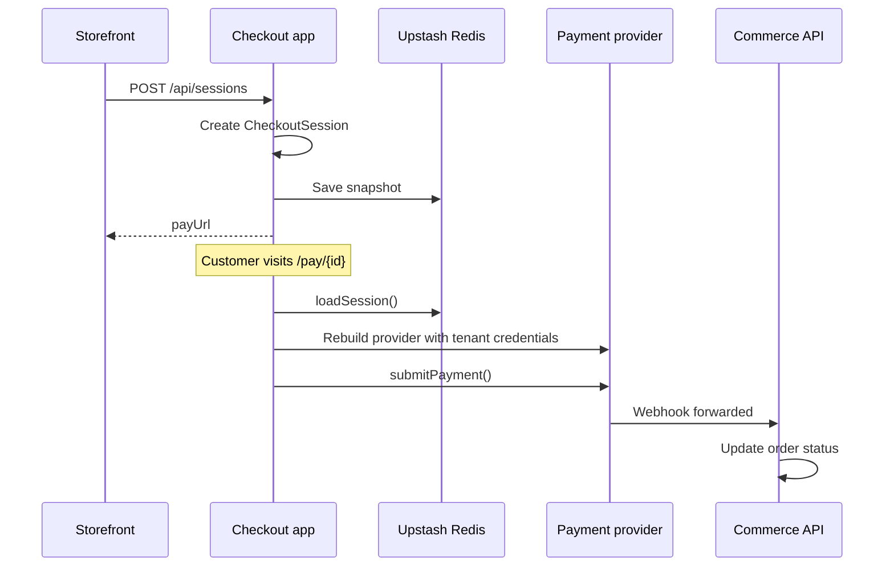

`apps/checkout` is the **hosted payment application**. After the storefront places an order, the customer is redirected here to complete payment via Stripe, Easypay, or Ifthenpay.

**Port:** 3004 · **Framework:** Next.js 16 · **Database:** None (Upstash Redis for sessions)

## Architecture

## Key dependencies

| Package | Role |
| --- | --- |
| `@prood/checkout-host` | Session create/load/persist, webhook forwarding |
| `@prood/checkout` | CheckoutSession state machine (used internally) |
| `@prood/types` | Error response helpers |
| `@prood/ui` | Button, skeleton, toast components |
| `@stripe/react-stripe-js` | Stripe Payment Element |

## Routes

| Route | Purpose |
| --- | --- |
| `/` | Landing / entry page |
| `/pay/[id]` | Payment UI |
| `/confirm/[id]` | Post-3DS / async confirmation |
| `/success/[id]` | Success page → redirect to storefront |

See [Sessions](/docs/apps/checkout/sessions) for API route details.

## Configuration

| Variable | Required | Purpose |
| --- | --- | --- |
| `UPSTASH_REDIS_REST_URL` | Yes | Redis REST endpoint |
| `UPSTASH_REDIS_REST_TOKEN` | Yes | Redis REST token |
| `CHECKOUT_API_SECRET` | Yes | Protects session creation API |
| `CHECKOUT_URL` | Yes | Public checkout base URL |
| `COMMERCE_API_URL` | Yes | Webhook forwarding target |
| `STOREFRONT_URL` | Yes | Post-payment redirect |
| `NEXT_PUBLIC_STRIPE_PUBLISHABLE_KEY` | Stripe | Client-side Stripe key |
| Payment provider env vars | Per provider | Fallback credentials |

## Security

- Session creation requires `x-checkout-secret` header — only trusted callers (storefront) can create sessions
- Webhook routes are org-scoped: `/api/webhooks/{provider}/{orgId}`
- Payment provider credentials loaded per tenant from encrypted integration config
- No direct database access — all order updates go through the Commerce API

## Related pages

<Cards>
  <Card title="Sessions" href="/docs/apps/checkout/sessions" description="Session API routes and Redis persistence." />
  <Card title="Payments" href="/docs/apps/checkout/payments" description="Stripe, Easypay, and Ifthenpay UI." />
  <Card title="Webhooks" href="/docs/apps/checkout/webhooks" description="Webhook routing and forwarding." />
  <Card title="Checkout flow" href="/docs/architecture/checkout-flow" description="State machine architecture." />
</Cards>
