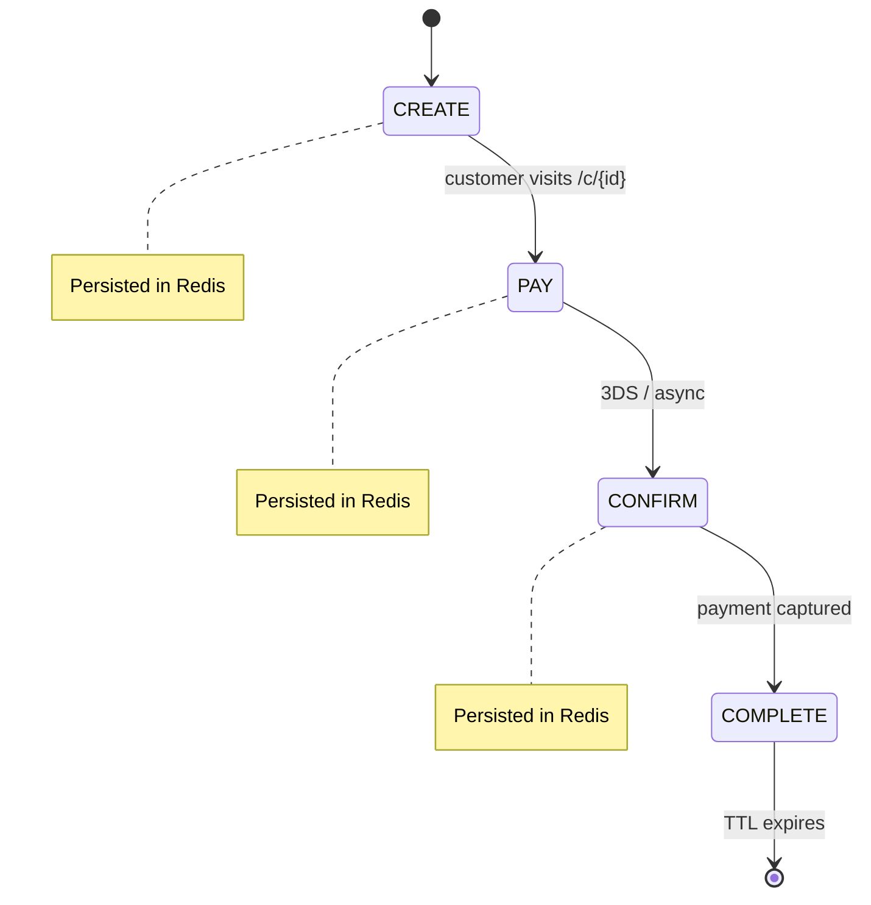

Checkout sessions are managed by `@prood/checkout-host` and persisted in **Upstash Redis**. Each session wraps a `@prood/checkout` CheckoutSession state machine snapshot.

## Session lifecycle



## API routes

### Create session

```
POST /api/sessions
Header: x-checkout-secret: {CHECKOUT_API_SECRET}
```

**Request body:**

```json
{
  "orderId": "ord_abc123",
  "amount": 9999,
  "currency": "EUR",
  "tenantId": "org_demo",
  "returnUrl": "http://localhost:3000/order-confirmation?order=ord_abc123",
  "customerInfo": {
    "email": "customer@example.com",
    "firstName": "Maria",
    "lastName": "Silva"
  },
  "fulfillment": "shipping",
  "provider": "stripe"
}
```

**Response:**

```json
{
  "id": "cs_abc123",
  "checkoutUrl": "http://localhost:3004/c/cs_abc123",
  "expiresAt": "2026-05-29T11:00:00.000Z"
}
```

Only callers with the correct `x-checkout-secret` can create sessions. This prevents unauthorized session creation.

### Load session

```
GET /api/sessions/{id}
```

Returns the current session snapshot (state, customer info, payment session, amount, etc.).

### Submit payment

```
POST /api/sessions/{id}/pay
```

**Request body (Stripe):**

```json
{
  "sourceToken": "pm_xxx"
}
```

**Request body (Easypay/Ifthenpay):**

```json
{
  "method": "multibanco"
}
```

Advances the CheckoutSession state machine and returns the payment session (may include `redirectUrl` for 3DS).

### Confirm payment

```
POST /api/sessions/{id}/confirm
```

Called after 3DS redirect or async confirmation:

```json
{
  "chargeId": "pi_xxx"
}
```

## Redis persistence

`@prood/checkout-host` stores session snapshots in Upstash Redis:

| Key pattern | TTL | Content |
| --- | --- | --- |
| `checkout:session:{id}` | Configurable (default 30 min) | Full CheckoutSession snapshot JSON |

### Hydration

On each request to `/c/{id}`:

1. `loadSession(id)` reads snapshot from Redis
2. `loadAndHydrate(id, providerFactory)` reconstructs CheckoutSession from snapshot
3. Payment provider rebuilt with tenant's credentials
4. State machine continues from saved state

### Expiry

Sessions with `expiresIn` set a TTL on the Redis key. After expiry:

- All state-mutating methods throw
- The `expired` event fires
- Customer sees an expiry message on the payment page

## Payment links

```
POST /api/payment-links
Header: x-checkout-secret: {CHECKOUT_API_SECRET}
```

Creates a shareable payment link (POS, invoice, etc.) without an existing order:

```json
{
  "amount": 4500,
  "currency": "EUR",
  "tenantId": "org_demo",
  "description": "Invoice #1234",
  "expiresIn": 86400000
}
```

Returns a URL like `http://localhost:3004/c/cs_link_abc`.

## Implementation

```ts
// @prood/checkout-host
import { createCheckoutSession, loadSession, saveSession } from '@prood/checkout-host'

// Create
const session = await createCheckoutSession({
  orderId,
  amount,
  currency,
  tenantId,
  returnUrl,
  provider: getPaymentProvider(providerId, tenantConfig),
})

// Load
const snapshot = await loadSession(sessionId)
const session = await loadAndHydrate(sessionId, (id) =>
  getPaymentProvider(id, tenantConfig)
)
```

## Related pages

<Cards>
  <Card title="@prood/checkout-host" href="/docs/packages/checkout-host" description="Package API reference." />
  <Card title="Payments" href="/docs/apps/checkout/payments" description="Provider-specific payment UI." />
</Cards>
