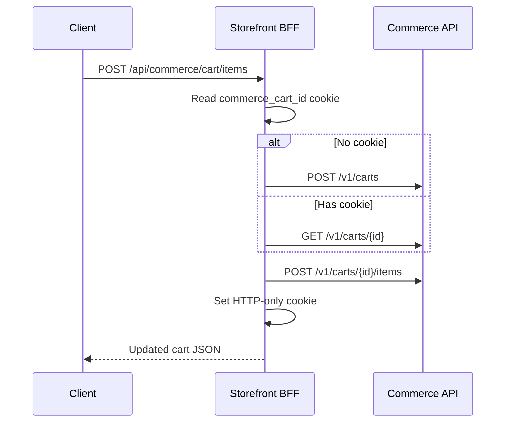

The storefront cart uses a **cookie-backed cart ID** with BFF routes for client-side operations, and a **server action** to place orders and redirect to the checkout app.

## Cart lifecycle

### 1. Cart creation

When a customer first adds an item:



### 2. Cart cookie

Defined in `lib/cart-cookie.ts`:

| Property | Value |
| --- | --- |
| Name | `commerce_cart_id` |
| HTTP-only | Yes |
| Max-Age | 30 days |
| SameSite | Lax |
| Secure | Yes (production) |

The cookie stores only the cart ID — not cart contents. Contents are always fetched from the API.

### 3. Cart operations

| Action | BFF route | API endpoint |
| --- | --- | --- |
| Read cart | `GET /api/commerce/cart` | `GET /v1/carts/{id}` |
| Add item | `POST /api/commerce/cart/items` | `POST /v1/carts/{id}/items` |
| Update quantity | `PATCH /api/commerce/cart/items/{itemId}` | `PATCH /v1/carts/{id}/items/{itemId}` |
| Remove item | `DELETE /api/commerce/cart/items/{itemId}` | `DELETE /v1/carts/{id}/items/{itemId}` |
| Apply coupon | `POST /api/commerce/cart/coupon` | `POST /v1/carts/{id}/coupon` |
| Remove coupon | `DELETE /api/commerce/cart/coupon` | `DELETE /v1/carts/{id}/coupon` |

### 4. Client state

`CartProvider` (React context) maintains client-side cart state for instant UI updates. It syncs with BFF routes on mount and after mutations.

## Checkout flow

### Step 1 — Checkout page

The `/checkout` page renders `CheckoutFlow` which collects:

- Customer email, first name, last name, phone
- Shipping address (street, city, country, postal code)
- Optional billing address
- Shipping method selection (from API `GET /v1/carts/{id}/shipping-methods`)

### Step 2 — Place order (server action)

`app/checkout/actions.ts` → `startCheckout()`:

1. PUT shipping and billing addresses on the cart via the Commerce API
2. Select the first available shipping method
3. `POST /v1/carts/{id}/place-order` — creates order with internal `customerId` (guest UUID or logged-in buyer)
4. `POST` checkout app `/api/sessions` with `orderId`, `customerId`, amount, `tenantId`, and `returnUrl` (no email in Redis metadata)
5. Redirect client to `checkoutUrl` from the session response

Email for payment (Stripe receipt) is collected at the checkout app pay boundary, not stored in the Redis session snapshot.

```ts
body: JSON.stringify({
  orderId: order.id,
  customerId: order.customerId,
  amount: priceToMajorAmount(order.totals.total),
  currency: order.totals.total.currency,
  tenantId,
  returnUrl: `${storefrontOrigin}/order-confirmation?orderId=${order.id}`,
  providerId,
  fulfillment: "none",
})
```

### Step 3 — Payment (checkout app)

The customer is redirected to `apps/checkout/c/{sessionId}`. See [Checkout app](/docs/apps/checkout) for payment UI details.

### Step 4 — Return to storefront

After successful payment:

1. Checkout app redirects to `/success/{sessionId}`
2. Success page redirects to storefront `returnUrl` (`/order-confirmation?order={id}`)
3. Order confirmation page fetches order details from API

## Error handling

| Error | Handling |
| --- | --- |
| Cart not found | BFF creates new cart, retries operation |
| Out of stock | API returns 409; client shows toast |
| Invalid coupon | API returns 400; form shows error message |
| Checkout session creation fails | Server action throws; checkout page shows error |
| Payment failed | Checkout app shows retry UI; order stays `pending` |

## Security considerations

- Cart cookie is HTTP-only — not accessible to JavaScript (XSS protection)
- Checkout session creation requires `x-checkout-secret` — only the storefront can create sessions
- Tenant ID is resolved server-side — never accepted from client input
- Order amounts are validated server-side by the API — not trusted from the client

## Related pages

<Cards>
  <Card title="Checkout app" href="/docs/apps/checkout" description="Payment UI, sessions, and webhooks." />
  <Card title="Checkout flow (architecture)" href="/docs/architecture/checkout-flow" description="State machine and payment lifecycle." />
  <Card title="Commerce API — carts" href="/docs/api" description="OpenAPI reference for cart endpoints." />
</Cards>
