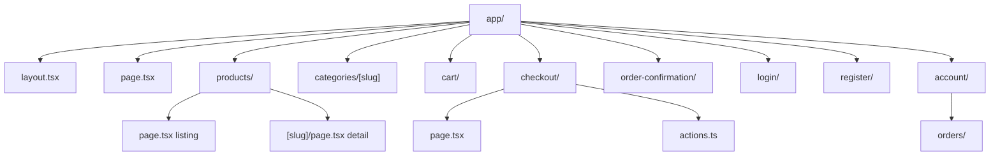

The storefront uses Next.js App Router with server components for catalog pages and client components for interactive cart/search UI.

## Page routes

| Route | Type | Description |
| --- | --- | --- |
| `/` | Server | Home — hero banner, featured products, category links |
| `/products` | Server | Product listing with search query and sort params |
| `/products/[slug]` | Server | Product detail — gallery, options, variant selector, add-to-cart |
| `/categories/[slug]` | Server | Category-filtered product grid |
| `/cart` | Server + Client | Full cart page with summary and checkout CTA |
| `/checkout` | Server + Client | Checkout form — customer info, shipping address, place order |
| `/order-confirmation` | Server | Post-payment order summary (query param: order ID) |
| `/login` | Client | Customer login form |
| `/register` | Client | Customer registration form |
| `/account` | Server | Account overview — profile info, recent orders |
| `/account/orders` | Server | Full order history (requires auth) |

### Layout structure



## API routes (BFF)

Local BFF routes proxy to the Commerce API where browser UX requires them:

| Route | Methods | Purpose |
| --- | --- | --- |
| `/api/auth/[...all]` | * | Better Auth handler |
| `/api/commerce/cart` | GET, POST | Read existing cart or create new cart |
| `/api/commerce/cart/items` | POST | Add item to cart |
| `/api/commerce/cart/items/[itemId]` | PATCH, DELETE | Update quantity or remove item |
| `/api/commerce/cart/coupon` | POST, DELETE | Apply or remove coupon code |
| `/api/commerce/search` | GET | Product search for client search palette |
| `/api/commerce/countries` | GET | Country list for address forms |

### Why BFF routes exist

The cart ID is stored in an HTTP-only cookie (`commerce_cart_id`). Client-side cart operations (add to cart from product page, update quantity in drawer) cannot read this cookie directly — the BFF reads it and forwards the request to the API with the correct cart ID and tenant context.

Catalog reads do **not** need BFF routes — they are fetched server-side in React Server Components.

## Components

### Layout

| Component | File | Purpose |
| --- | --- | --- |
| `Header` | `components/header.tsx` | Logo, navigation, search, cart button, auth links |
| `Footer` | `components/footer.tsx` | Store links, legal, social |
| `Search` | `components/search.tsx` | Search palette trigger |
| `CartButton` | `components/cart-button.tsx` | Cart icon with item count badge |
| `MobileMenu` | `components/mobile-menu.tsx` | Responsive navigation drawer |
| `ThemeToggle` | `components/theme-toggle.tsx` | Light/dark mode switch |

### Commerce

| Component | Purpose |
| --- | --- |
| `ConnectedProductGrid` | Server-fetched product grid with add-to-cart |
| `AddToCart` | Variant-aware add-to-cart button |
| `CheckoutFlow` | Multi-step checkout form |

### Providers

| Provider | Purpose |
| --- | --- |
| `AppProviders` | Theme, toast (sonner), cart context wrapper |
| `CartProvider` | Client cart state — syncs with BFF routes |

## Data fetching

Server components use fetchers from `lib/commerce-data.ts`:

```ts
// Example: product listing page
import { getProducts, getCategories } from '@/lib/commerce-data'

export default async function ProductsPage({ searchParams }) {
  const products = await getProducts({ query, sort, page })
  const categories = await getCategories()
  // ...
}
```

These fetchers wrap `@prood/api-client` and forward the request `Host` header for tenant resolution.

## Caching

Catalog pages benefit from Next.js Cache Components:

- Product listings: cached per tenant, 600s SWR
- Categories: cached per tenant, 600s SWR
- Store info: cached per tenant, 3600s SWR

Cart, checkout, and account pages are **never cached** — they depend on cookies and session state.

## Related pages

<Cards>
  <Card title="Cart & checkout" href="/docs/apps/storefront/cart-checkout" description="Cart cookie flow and checkout redirect." />
  <Card title="Storefront overview" href="/docs/apps/storefront" description="Architecture and configuration." />
</Cards>
