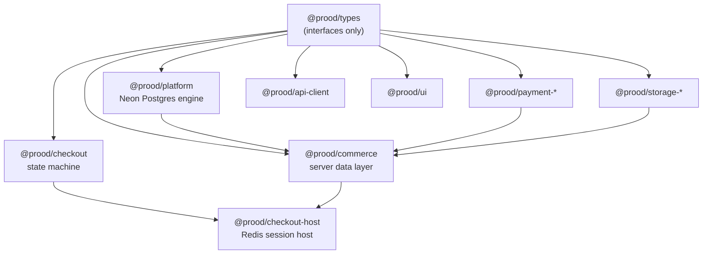

Prood packages are organized by responsibility. Applications compose them — no package depends on an app.

## Package dependency graph

## Core stack

| Package | Version | Description |
| --- | --- | --- |
| [`@prood/types`](/docs/packages/types) | 0.3.0 | Unified data model — 20+ domain types, adapter and provider interfaces |
| [`@prood/platform`](/docs/packages/platform) | 0.5.4 | Built-in commerce engine — Neon Postgres, Drizzle, RLS, Admin API |
| [`@prood/commerce`](/docs/packages/commerce) | 0.0.0 | Server-only data layer — caching, tenant scope, provider factory |
| [`@prood/checkout`](/docs/packages/checkout) | 2.0.0 | Framework-agnostic checkout state machine |
| [`@prood/checkout-host`](/docs/packages/checkout-host) | 0.0.0 | Next.js session host with Upstash Redis |

## Client & UI

| Package | Version | Description |
| --- | --- | --- |
| [`@prood/api-client`](/docs/packages/api-client) | 0.0.0 | Typed OpenAPI fetch client |
| [`@prood/ui`](/docs/packages/ui) | 0.0.0 | shadcn/Radix + 33+ commerce components |

## Providers

| Package | Version | Description |
| --- | --- | --- |
| [`@prood/payment-stripe`](/docs/packages/payments/stripe) | 0.1.0 | Stripe Payment Element via PaymentIntents |
| [`@prood/payment-easypay`](/docs/packages/payments/easypay) | 0.1.0 | Portugal — Multibanco, MB WAY, card |
| [`@prood/payment-ifthenpay`](/docs/packages/payments/ifthenpay) | 0.1.0 | Portugal — Multibanco, MB WAY, credit card |
| [`@prood/storage-vercel-blob`](/docs/packages/storage/vercel-blob) | 0.1.0 | Vercel Blob storage provider |
| [`@prood/storage-s3`](/docs/packages/storage/s3) | 0.2.0 | S3-compatible storage (AWS, R2, MinIO) |

## Tooling (private)

| Package | Description |
| --- | --- |
| `@prood/eslint-config` | Shared ESLint configs |
| `@prood/typescript-config` | Shared TypeScript configs |

## Which package do I need?

| Task | Package(s) |
| --- | --- |
| Build a storefront page | `@prood/api-client`, `@prood/ui`, `@prood/types` |
| Add a payment provider | `@prood/payment-*`, register in `@prood/commerce` |
| Custom commerce adapter | `@prood/types` (implement `CommerceAdapter`) |
| Direct database access | `@prood/platform` (prefer API for apps) |
| Hosted checkout session | `@prood/checkout-host` |
| Upload product images | `@prood/storage-*` via `@prood/commerce` |

## Package guides

<Cards>
  <Card title="@prood/types" href="/docs/packages/types" description="Unified domain model and interfaces." />
  <Card title="@prood/platform" href="/docs/packages/platform" description="Built-in Postgres commerce engine." />
  <Card title="@prood/commerce" href="/docs/packages/commerce" description="Server data layer and provider factory." />
  <Card title="Payment providers" href="/docs/packages/payments" description="Stripe, Easypay, Ifthenpay." />
  <Card title="Storage providers" href="/docs/packages/storage" description="Vercel Blob and S3." />
  <Card title="@prood/ui" href="/docs/packages/ui" description="Shared React components." />
</Cards>
