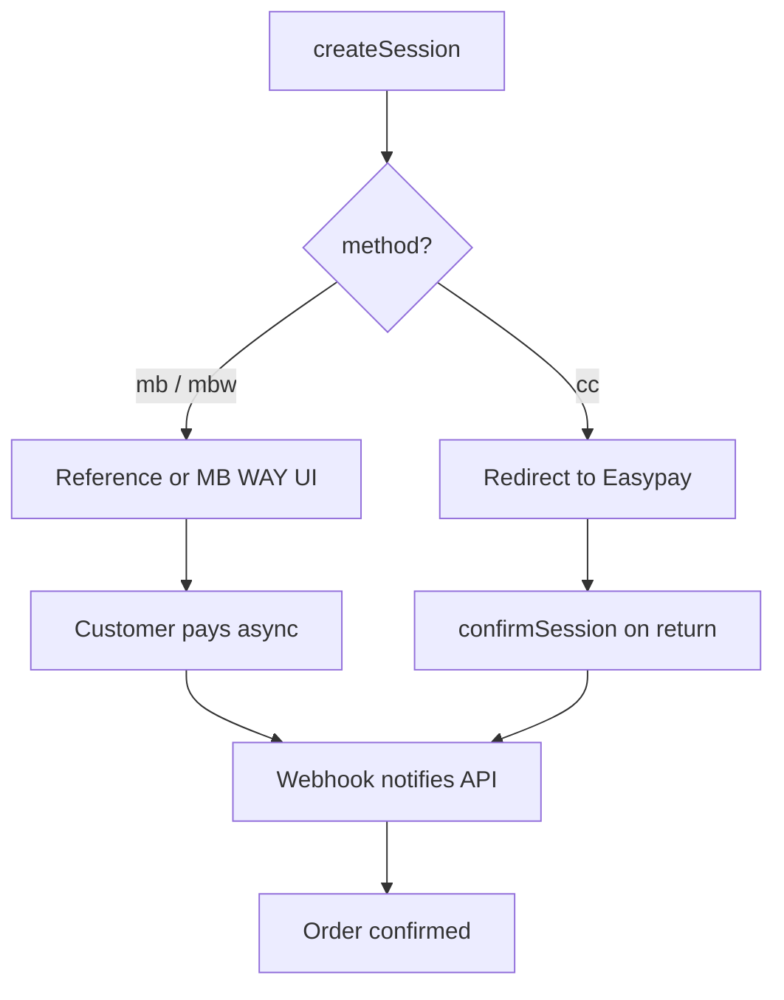

`@prood/payment-easypay` implements the `PaymentProvider` interface for [Easypay](https://www.easypay.pt/) — a Portuguese payment gateway supporting Multibanco references, MB WAY, and credit card.

## Installation

```bash
pnpm add @prood/payment-easypay
```

## Usage

```ts
import { EasypayPaymentProvider } from '@prood/payment-easypay'

const provider = new EasypayPaymentProvider({
  accountId: process.env.EASYPAY_ACCOUNT_ID!,
  apiKey: process.env.EASYPAY_API_KEY!,
  baseUrl: process.env.EASYPAY_BASE_URL ?? 'https://api.prod.easypay.pt',
})
```

## Configuration

| Field | Env var | Description |
| --- | --- | --- |
| `accountId` | `EASYPAY_ACCOUNT_ID` | Easypay account ID |
| `apiKey` | `EASYPAY_API_KEY` | API key |
| `baseUrl` | `EASYPAY_BASE_URL` | API base URL |

### Environments

| Environment | Base URL |
| --- | --- |
| Production | `https://api.prod.easypay.pt` |
| Sandbox | `https://api.test.easypay.pt` |

## Payment methods

| Method | Flow | UI |
| --- | --- | --- |
| **Multibanco** | Reference-based | Entity + reference displayed; customer pays at ATM/homebanking |
| **MB WAY** | Push notification | Phone number input; customer confirms on phone |
| **Credit card** | Redirect | Redirect to Easypay hosted payment page |

## Selecting a method

Pass `metadata.method` on `createSession()` (defaults to `mb`):

| `metadata.method` | Flow |
| --- | --- |
| `mb` | Multibanco reference (entity + reference) |
| `mbw` | MB WAY push notification |
| `cc` | Redirect to Easypay hosted card page |

```ts
const session = await provider.createSession({
  amount: 29.99,
  currency: 'EUR',
  orderId: 'ord_456',
  metadata: { method: 'mb' },
})
```

Easypay confirms payments asynchronously via notifications. Use `confirmSession()` after redirect, but treat webhooks as the authoritative completion signal for reference payments.

## Factory usage

```ts
import { getPaymentProvider } from '@prood/commerce'

const provider = await getPaymentProvider('easypay', orgId)
```

## Payment flow



## Webhook setup

Configure in Easypay merchant panel:

```
URL: https://pay.example.com/api/webhooks/easypay/{orgId}
```

## Related pages

<Cards>
  <Card title="Payment integration" href="/docs/guides/payment-integration" description="Setup guide." />
  <Card title="Checkout payments" href="/docs/apps/checkout/payments" description="Reference payment UI." />
</Cards>
