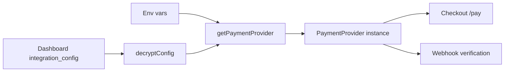

All payment providers implement the same `PaymentProvider` interface from `@prood/types`. The checkout state machine and `@prood/commerce` factory work with any registered provider.

## Available providers

| Provider | Region | Methods | Doc |
| --- | --- | --- | --- |
| **Stripe** | Global | Cards via Payment Element | [Stripe](/docs/packages/payments/stripe) |
| **Easypay** | Portugal | Multibanco, MB WAY, card | [Easypay](/docs/packages/payments/easypay) |
| **Ifthenpay** | Portugal | Multibanco, MB WAY, card | [Ifthenpay](/docs/packages/payments/ifthenpay) |

## How providers are loaded

Per-tenant credentials from the dashboard **override** env fallbacks field-by-field. See [Payment integration guide](/docs/guides/payment-integration).

## Interface

Every provider implements:

| Method | Purpose |
| --- | --- |
| `createSession()` | Start a charge / PaymentIntent / reference |
| `confirmSession()` | Verify after redirect or async completion |
| `refund()` | Full or partial refund |
| `verifyWebhook()` | Validate provider signature on webhook payload |

## Related pages

<Cards>
  <Card title="Payment integration" href="/docs/guides/payment-integration" description="End-to-end setup guide." />
  <Card title="Checkout payments" href="/docs/apps/checkout/payments" description="Payment UI in the checkout app." />
  <Card title="Dashboard integrations" href="/docs/apps/dashboard/integrations" description="Per-tenant credential storage." />
</Cards>
